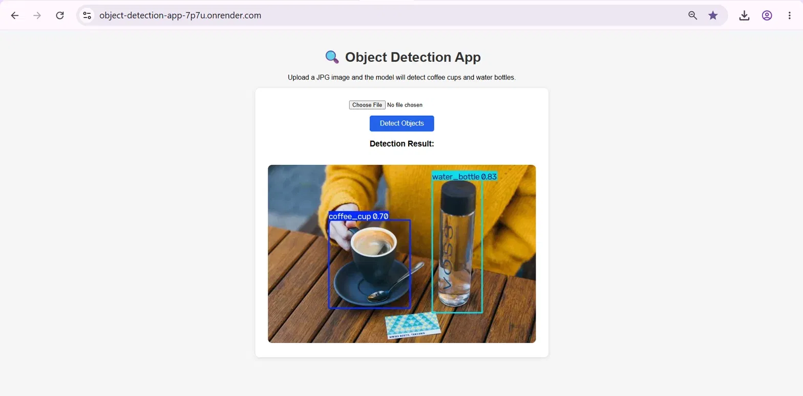

# object-detection-app
YOLOv8 object detection deployed with Flask and Docker

A web application that detects coffee cups and water bottles in images. For the live demo access it through: https://object-detection-app-7p7u.onrender.com

What does the model do

The model is a YOLOv8s trained on a custom dataset (coffee cups vs water bottles) from Roboflow for 30 epochs. You upload a JPG image, and the app returns the same image with boxes drawn around every detected cup or bottle, with a confidence score for each.

How to run it locally with Docker

- Install Docker Desktop
- Clone this repository and enter the folder
- Build: `docker build -t object-detection-app .`
- Run: `docker run -p 5000:5000 object-detection-app`
- Open `http://127.0.0.1:5000` in your browser

How to use the interface

- Open the app link
- Click **Choose File** and select a JPG image
- Click **Detect Objects**
- The image appears with boxes around the detected cups and bottles

Known issues and limitations

- The free server sleeps after 15 minutes of inactivity, first visit takes around 1 minute to wake up
- The first detection is slower because the model loads on the first request
- Only JPG images are accepted
- Complex images might have miss some detection

Preview

References used:
- ZAKA Course deployment demo (Flask + Docker live session)
- Flask documentation — file uploads and templates
- Ultralytics documentation — YOLOv8 prediction
